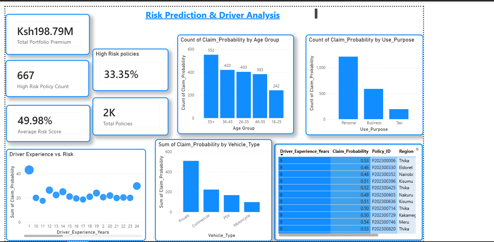

# Predictive Motor Insurance Risk Analytics Dashboard 🇰🇪

## 📌 Project Overview
This project addresses a critical challenge in the Kenyan insurance sector: **Identifying high-risk policyholders before claims occur.** Using a synthetic dataset of 2,000 Kenyan motor insurance policies, I developed a machine learning pipeline that predicts the probability of a claim. The results are visualized in an interactive Power BI dashboard designed for executive decision-making and actuarial underwriting.

## 🚀 Key Features
* **Predictive Modeling:** A Logistic Regression model (Scikit-Learn) that assigns a "Risk Score" (0.0 to 1.0) to every policyholder.
* **Risk Segmentation:** Automated categorization of clients into **Low**, **Medium**, and **High Risk** tiers.
* **Actuarial Insights:** Deep-dive visuals showing how **Driver Experience**, **Age**, and **Vehicle Use** impact claim probability.
* **Interactive Geospatial Analysis:** A map-based view of risk concentration across Kenya (Nairobi, Mombasa, Kisumu, etc.).

## 🛠️ The Tech Stack
1.  **Python (Data Science):** * `Pandas` for data engineering.
    * `Scikit-Learn` for Logistic Regression and Feature Scaling.
    * `LabelEncoder` for handling categorical Kenyan regional data.
2.  **Power BI (Business Intelligence):**
    * **Advanced M-Query:** Used to bridge the Python model output into the BI environment.
    * **DAX Measures:** Created custom KPIs for *% High-Risk Policies* and *Average Portfolio Risk*.
    * **Data Modeling:** Established a star schema for efficient filtering and slicing.

## 📊 Dashboard Insights
* **Total Portfolio Value:** KES 211M
* **Average Claim Probability:** 48%
* **Key Finding:** Drivers with **< 2 years of experience** (Novices) carry a ~70% risk rate, compared to just ~31% for veterans.
* **High-Risk Segment:** 18-25 year olds using vehicles for commercial/taxi purposes represent the highest liability.

